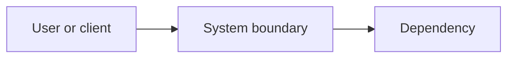

# <System or boundary name>

## Purpose

<What this part of the system is responsible for.>

## Context

## Components

| Component | Responsibility | Interface |
|---|---|---|
| <component> | <responsibility> | <API, event, or file> |

## Data flow

<Describe the important request, event, or data flows.>

## Data model

This section is a **summary and a pointer**, not the model itself. The full model — ERD, data dictionary, classification, retention, and authorization mapping — lives in [data-model.md](data-model.md), which is required whenever the change carries the `database` tag or introduces persistent state.

- Data model document: `<path, e.g. docs/architecture/data-model.md>` — or `n/a, because <reason>`
- Store(s) and ownership: <engine, and which component may write to it>
- Schema source of truth: `<path>`
- Entities in scope: <list>
- The one structural rule a newcomer gets wrong: <e.g. "transactions reference an item, never a category directly">

<Do not restate the data dictionary here. Two copies of a schema means one of them is stale, and it will be this one.>

## Invariants

- <rule that must remain true>

## Operational concerns

- Availability: <expectation>
- Observability: <logs, metrics, alerts>
- Security: <trust boundaries and controls>
- Recovery: <failure and rollback behavior>

## Related decisions

- <ADR link>
