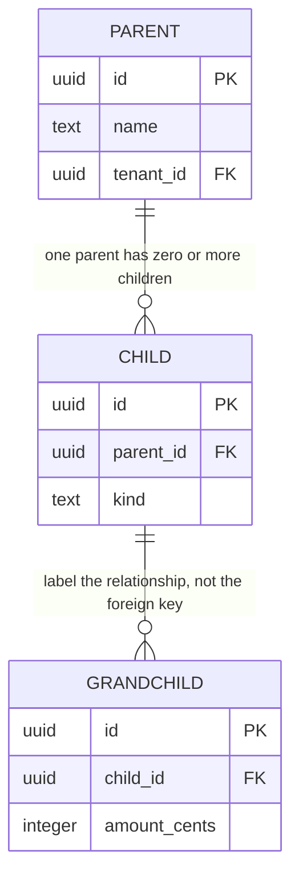

# Data model: <system or bounded context>

The database outlives the code that wrote it. An application mistake ships a bug; a data model mistake ships a bug plus a migration, and every consumer that already read the wrong shape.

This document exists because "the schema file is the documentation" is only true for someone who already knows the domain. The schema records column types. It does not record *why* a transaction points at an item and never at a category, which column is the tenant boundary, which field is regulated, or what may be deleted. Those are the facts a reviewer and the next agent need, and they are the facts this template captures.

Fill every section. **`<none>` with a reason is an answer; a blank is not.**

## Scope and ownership

- **Bounded context:** <what this model is responsible for>
- **Store:** <engine and version, e.g. PostgreSQL 16, SQLite 3.45>
- **Location:** <connection target or file path>
- **Schema source of truth:** `<path, e.g. server/db/schema.ts>` — this document describes it; it does not replace it. If the two disagree, the source wins and this document is stale.
- **Migration tool and directory:** `<e.g. Drizzle, drizzle/>`
- **Owner:** <role accountable for schema changes>

## Conceptual model

Describe the domain in prose and plain nouns, before any table appears. A reader who does not know this product should finish this section able to predict the table list.

<Two or three paragraphs. Name each entity, say what one row means in the real world, and state the relationship rules in words — including the ones the schema cannot express.>

```text
<entity>
  └── <child entity>        <cardinality and rule in a few words>
        └── <grandchild>
```

## Entity relationship diagram

Structural, not decorative. Show every entity in scope, its keys, and the cardinality and optionality of every relationship. Cardinality is the part reviewers actually check, so use crow's-foot notation rather than plain arrows.



Read the notation as: `||--o{` one-to-many with an optional many side · `||--|{` one-to-many requiring at least one · `}o--o{` many-to-many (name the join table and give it its own box) · `||--||` one-to-one (say why this is not one table).

If the model is large, split it into one diagram per bounded context rather than producing one diagram nobody can read.

## Data dictionary

One table per entity. This is the section that gets skipped and the section that gets read six months later.

`Class` is the data classification: `public` · `internal` · `pii` · `sensitive` · `regulated`. Nothing may be left unclassified — an unclassified column is treated as `sensitive` until someone says otherwise, which is deliberately the inconvenient default.

### `<table_name>`

**One row means:** <a single real-world fact, in one sentence.>

| Column | Type | Null | Default | Key / constraint | Class | Meaning and rules |
|---|---|---|---|---|---|---|
| `id` | <uuid> | no | <generated> | PK | internal | <identity; stable forever?> |
| `<tenant_id>` | <uuid> | no | — | FK → `<table>.id` | internal | <the isolation boundary; every query must filter on it> |
| `<column>` | <type> | yes/no | <default> | <unique, check, FK> | <class> | <what it means, valid range, who may set it> |
| `created_at` | <timestamptz> | no | <now()> | — | internal | <set on insert, never updated> |
| `updated_at` | <timestamptz> | no | <now()> | — | internal | <maintained by app or trigger — say which> |

**Indexes**

| Index | Columns | Kind | Why it exists |
|---|---|---|---|
| `<name>` | `(<cols>)` | <btree, unique, partial, gin> | <the query it serves — name it> |

An index with no named query is either dead weight or an undocumented access pattern. Both are worth catching here.

**Constraints beyond column level**

| Constraint | Rule | Enforced where |
|---|---|---|
| `<name>` | `<CHECK / UNIQUE / EXCLUDE expression>` | <database, application, or both> |

State "database and application" only when it is actually both. A rule enforced solely in the application is a rule any other writer — a script, a migration, a second service — will violate.

<Repeat the whole block for each table.>

## Relationships and referential actions

Deletion behavior is a product decision disguised as a schema detail. Decide it here, not in the migration.

| From | To | Cardinality | On parent delete | On parent update | Rationale |
|---|---|---|---|---|---|
| `<child.parent_id>` | `<parent.id>` | <many-to-one, required> | <restrict / cascade / set null / soft-delete> | <no action> | <why this is right for the domain> |

## Enumerations and controlled vocabularies

| Name | Allowed values | Stored as | Extensible? | Where enforced |
|---|---|---|---|---|
| `<enum>` | `<a \| b \| c>` | <native enum, text + CHECK, lookup table> | <yes — adding a value is a migration / no> | <database, application> |

Adding a value to a native enum is a migration and can be awkward to reverse; a lookup table is cheaper to extend and harder to typo. Choose deliberately and record the choice.

## Derived and computed values

Anything that could be recomputed but is stored anyway, or is computed on read and therefore has no column.

| Value | Derived from | Stored or computed | Staleness risk | Recompute path |
|---|---|---|---|---|
| `<e.g. monthly total>` | `<source columns>` | <stored / computed on read / materialized view> | <how it can go wrong> | <command or job> |

Every stored derivation is a cache, and every cache can be wrong. If nothing can recompute it, it is not a derivation — it is the source of truth, and it should be described as one.

## Identity, multi-tenancy, and isolation

- **Primary key strategy:** <uuid v7, bigserial, natural key> — <why; note whether keys are exposed to clients>
- **Tenant/isolation column:** `<column>` on `<tables>` — <or "single-tenant">
- **How isolation is enforced:** <row-level security, mandatory query scope, separate schema> — name the mechanism, not the intention
- **Cross-tenant query risk:** <the specific query shapes that could leak, and what prevents them>

Broken access control is the most common serious vulnerability in real applications, and it is nearly always a missing filter on exactly this column. See [../standards/security.md](../standards/security.md); the denied-path tests that prove the filter works are required by [../standards/testing.md](../standards/testing.md).

## Authorization mapping

Which caller may see and change which rows. This is the input to the authorization tests, so write it as rows a test can be generated from.

| Role | Table | Read scope | Write scope | Enforced at |
|---|---|---|---|---|
| `<role>` | `<table>` | <all / own tenant / own rows / none> | <create, update own, none> | <endpoint, query layer, RLS policy> |

## Integrity invariants

Statements that must be true of the data at rest, whatever the application does. These are the assertions worth testing directly against the database.

- <e.g. every `transaction.item_id` resolves to a non-archived item, or the transaction predates archival>
- <e.g. no two active rows share `(tenant_id, slug)`>
- <e.g. `amount_cents` is a non-negative integer; currency is never stored as a float>

## Volume, growth, and access patterns

| Table | Expected rows (now / 1yr) | Write rate | Hottest query | Notes |
|---|---|---|---|---|
| `<table>` | <n / n> | <per day> | <the query that must stay fast> | <partitioning or archival plan> |

A model that is correct at a thousand rows and unusable at ten million is a defect that shipped. If the answer is "small forever", write that — it is a real answer and it justifies leaving the indexes alone.

## Classification, retention, and deletion

| Data class | Where it lives | Retention | Deletion mechanism | Legal/policy driver |
|---|---|---|---|---|
| `<pii>` | `<table.column>` | <duration or "indefinite — justified by">| <hard delete, anonymize, crypto-shred> | <policy or "none stated"> |

- **Right-to-erasure path:** <the actual sequence that removes one subject's data, including from backups and derived tables — or "not applicable, because">
- **Backups and clones:** <what a non-production clone must mask; see [../standards/database.md](../standards/database.md)>

"Indefinite" is an acceptable answer only when written down on purpose. Retention that was never decided is the same data hazard as retention that was decided badly, minus the audit trail.

## Migration and seed mapping

| Change in this document | Migration | Reversible? | Expand/contract phase |
|---|---|---|---|
| `<new column>` | `<migration file>` | <yes / forward-fix only> | <expand / backfill / contract> |

- **Migration plan:** `<link to the migration-plan.md for this change, or "n/a — no schema change">`
- **Seed profile:** `<named, versioned seed this model requires for Preview>` — see [../standards/database.md](../standards/database.md)

A released migration is immutable. If this document changes after release, it changes forward.

## Open questions

| Question | Blocks | Owner | Needed by |
|---|---|---|---|
| <undecided modelling choice> | <what it blocks> | <who decides> | <date> |

## Agent instruction

Produce this document **before** writing the migration or the schema file, not as a transcription of them afterwards. A data model reverse-engineered from code you already wrote records the decisions you happened to make; the point of this document is to make those decisions reviewable while they are still cheap to change.

Do not invent classification, retention, or authorization values. If the project has not decided, write `pending` with an owner and stop — a fabricated retention period is worse than an admitted gap, because it looks like a decision.

Every table in the ERD must appear in the data dictionary, and every dictionary table must appear in the ERD. Every enumeration referenced in the dictionary must be listed in the enumerations table. If the schema source already exists, verify the document against it column by column and report any drift rather than silently copying one side.

The `database` tag forces Track C. Do not proceed to planning without this document and an approved [migration plan](migration-plan.md).
