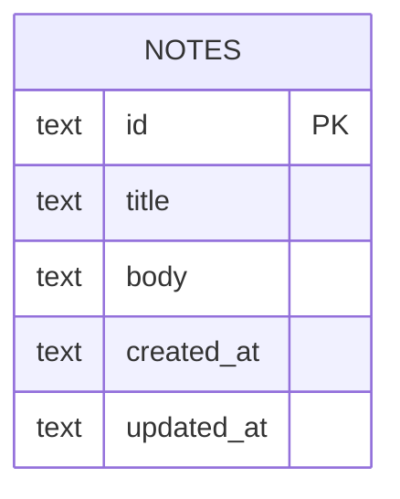

# Data model: AIDF Quick Notes

## Scope and ownership

- **Bounded context:** Personal local notes for a single developer machine
- **Store:** SQLite 3 (via better-sqlite3)
- **Location:** File path from `SQLITE_PATH` (default `./data/notes.sqlite`)
- **Schema source of truth:** `server/database/schema.ts`
- **Migration tool and directory:** Drizzle Kit · `server/database/migrations/`
- **Owner:** prishanf

## Conceptual model

A note is a short piece of text a person wants to keep: a required title and an optional body. There are no folders, tags, or owners. One SQLite file holds every note for that local instance. Create/list (Feature 1) and hard delete (Feature 2) do not change what a note is; edit (Feature 3) may update `title`/`body`/`updated_at` later without changing the entity.

```text
note
  └── (no child entities in Feature 1)
```

## Entity relationship diagram



Single entity. No relationships in Feature 1.

## Data dictionary

### `notes`

**One row means:** One saved note belonging to this local SQLite file.

| Column | Type | Null | Default | Key / constraint | Class | Meaning and rules |
|---|---|---|---|---|---|---|
| `id` | text | no | app-generated UUID | PK | internal | Stable identity; exposed to clients |
| `title` | text | no | — | CHECK length 1–120 (app + DB if practical) | internal | Required display title |
| `body` | text | no | `''` | max 5000 chars (app) | internal | Optional body; empty string when absent |
| `created_at` | text (ISO-8601) | no | insert time | — | internal | Set on insert; never updated |
| `updated_at` | text (ISO-8601) | no | insert time | — | internal | Set on insert; advanced on Feature 3 edit (`PATCH`) |

**Indexes**

| Index | Columns | Kind | Why it exists |
|---|---|---|---|
| `notes_created_at_idx` | `(created_at DESC)` | btree | Serves `GET /api/notes` newest-first |

**Constraints beyond column level**

| Constraint | Rule | Enforced where |
|---|---|---|
| title length | 1–120 characters after trim | application (required); DB CHECK if Drizzle supports |
| body length | ≤ 5000 characters | application |

## Relationships and referential actions

| From | To | Cardinality | On parent delete | On parent update | Rationale |
|---|---|---|---|---|---|
| none | none | — | — | — | Single table; no FKs |

## Enumerations and controlled vocabularies

| Name | Allowed values | Stored as | Extensible? | Where enforced |
|---|---|---|---|---|
| none | — | — | — | No enums in Feature 1 |

## Derived and computed values

| Value | Derived from | Stored or computed | Staleness risk | Recompute path |
|---|---|---|---|---|
| none | — | — | — | No stored derivations |

## Identity, multi-tenancy, and isolation

- **Primary key strategy:** UUID string (v4 or v7) generated in the API — opaque to users, safe to expose
- **Tenant/isolation column:** none — single-tenant local file
- **How isolation is enforced:** process + filesystem permissions on the SQLite file; no auth layer
- **Cross-tenant query risk:** none — there is no tenant boundary; any client that can reach the server can read/write all notes

## Authorization mapping

| Role | Table | Read scope | Write scope | Enforced at |
|---|---|---|---|---|
| anonymous local caller | `notes` | all rows | create + update + hard delete (Features 1–3) | none — intentional for this example (ADR 0001) |

Denied-path authorization tests are **not applicable** until auth exists. HTTP tests still cover validation failures (400).

## Integrity invariants

- Every `notes.title` is non-empty after trim and ≤ 120 characters
- Every `notes.body` is ≤ 5000 characters
- `created_at` ≤ `updated_at` for every row
- `id` values are unique

## Volume, growth, and access patterns

| Table | Expected rows (now / 1yr) | Write rate | Hottest query | Notes |
|---|---|---|---|---|
| `notes` | 0–100 / ≤1000 | low (manual) | list by `created_at` desc | Example scale; no partitioning |

## Classification, retention, and deletion

| Data class | Where it lives | Retention | Deletion mechanism | Legal/policy driver |
|---|---|---|---|---|
| internal | `notes.*` | indefinite for this example | Feature 2 hard delete; or delete SQLite file | none stated — developer-owned synthetic data |

- **Right-to-erasure path:** not applicable — no multi-user identity; delete the local DB file
- **Backups and clones:** local file copies only; no production PII expected

## Migration and seed mapping

| Change in this document | Migration | Reversible? | Expand/contract phase |
|---|---|---|---|
| Create `notes` table + index | `server/database/migrations/0000_parched_leo.sql` | forward-fix only | expand |

- **Migration plan:** `docs/migrations/001-create-notes.md`
- **Seed profile:** `preview-notes-v1` — synthetic 32-ish notes for Preview (optional; mockup fixtures already exist)

## Open questions

| Question | Blocks | Owner | Needed by |
|---|---|---|---|
| none | — | — | — |

## Agent instruction

Do not write the migration until the implementation plan that references this document is approved. If schema drifts from this document, update this document in the same change.
