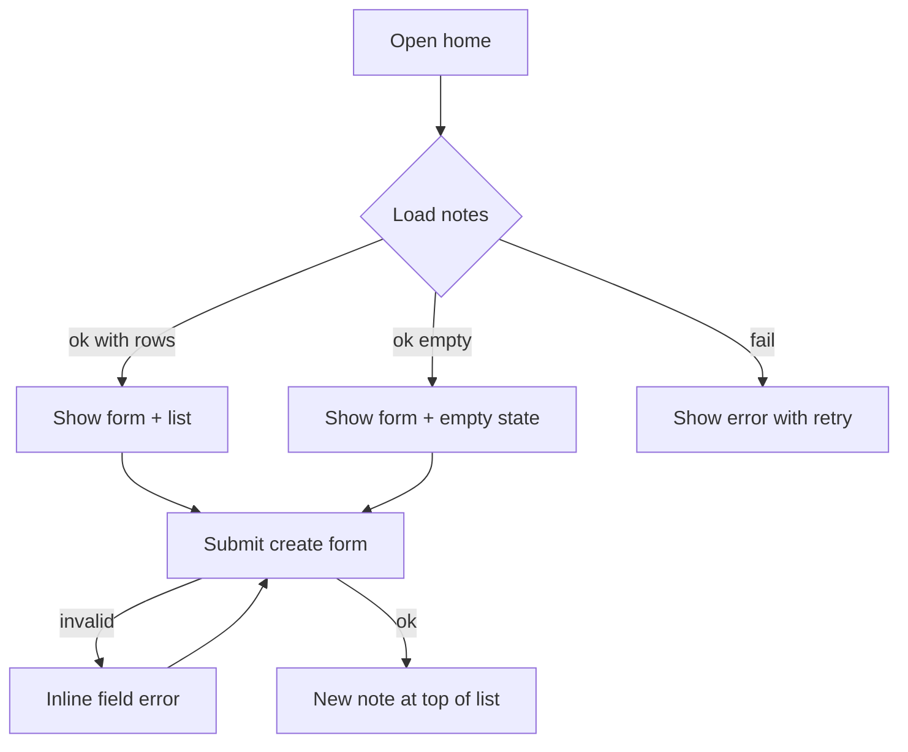

# Design: Create and list notes

## User goal

Capture a short note and see it again in a single-page list, newest first.

## Flow

## States

| State | User sees | Available actions |
|---|---|---|
| Empty | Form + dashed empty panel: “No notes yet” | Fill form and save |
| Loading | Skeleton rows where the list will be | Wait |
| Success | Form + list of notes (title, body or —, timestamp) | Create another note |
| Validation error | Red border + message under title | Correct title and resubmit |
| Server error | Alert with “Try again” | Reload / retry |
| Permission error | Alert without retry (illustrative; no real auth yet) | None in this example |

## UI foundation

- Is this the project's first `ui` change? `yes`
- Foundation document: `docs/design/ui-foundation.md` — created by this change
- Tokens added or changed: full initial token set in `app/assets/css/tokens.css` (teal primary on cool gray canvas)

## Mockup

Static HTML/CSS/JS with fabricated data. **Throwaway — do not reuse markup as the implementation.** Only the token layer is shared with the app.

- Location: `docs/design/mockups/create-and-list-notes/`
- Run it with: `npm run mockup:serve` (serves over HTTP; do not open as a file)
- Screens/states covered: Notes screen; success, loading, empty, server error, permission error, validation error
- Fixture volume: 32 notes in `data/seed.json`
- Token layer used: `app/assets/css/tokens.css` (copied to mockup `css/tokens.css`)
- Not required, because: n/a

## Accessibility and compatibility

- Keyboard: tab through title, body, Save; visible focus ring
- Screen reader: labels, `aria-invalid`, live region on save; empty/loading announced
- Responsive behavior: single column; content max ~42rem; checked at base and `sm`+
- Localization: English copy; en-US date-time formatting

## Acceptance notes

- [ ] Reviewer can create a note in the mockup and see it at the top of the list
- [ ] Empty, loading, error, forbidden, and validation states are reachable by click
- [ ] 32-row list is scannable; narrow width does not sideways-scroll the page
- [ ] Foundation palette and type are acceptable for later features

## Approval

- Decision: `approved`
- Approver: prishanf
- Date: 2026-07-28
- Notes: Approved together with UI foundation and mockup. Plan may proceed.

## Agent instruction

Do not write an implementation plan until `Approval.decision` is `approved`. The approved design and mockup — not later chat — are the source of truth for build. Do not copy mockup markup into the Nuxt application.
