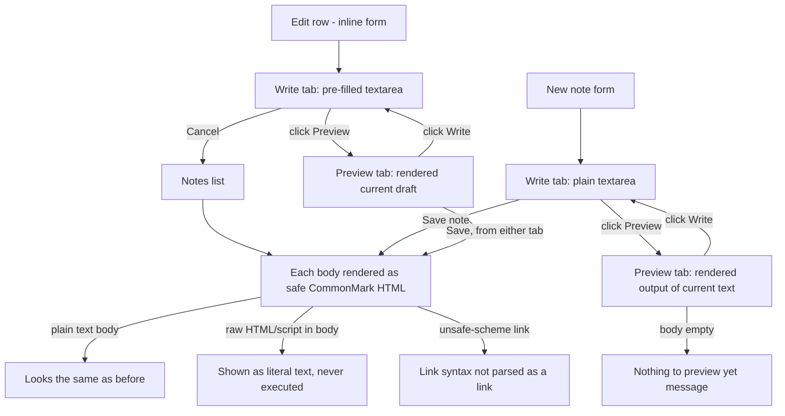

# Design: Markdown-formatted note body

## User goal

Write a note body as plain text or Markdown — interchangeably, no mode switch — and see it rendered as formatted HTML in the list, with a live Preview available while creating or editing.

## Flow

## States

| State | User sees | Available actions |
|---|---|---|
| List, plain-text body | Rendered exactly as before (no Markdown syntax present) | Edit, Delete unchanged |
| List, Markdown body | Heading/bold/italic/link/list/code/blockquote rendered as HTML | Edit, Delete unchanged |
| List, raw HTML/script in body | Tags shown as literal visible text (e.g. `<script>...`), never executed | Edit, Delete unchanged |
| List, unsafe-scheme link (`javascript:`) | The `[text](javascript:...)` syntax does not parse as a link at all — shown as literal bracket/paren text, not a clickable/inert anchor | Edit, Delete unchanged |
| Create form, Write tab (default) | Plain textarea, same as today | Type; switch to Preview; Save |
| Create form, Preview tab | Rendered output of the current (unsaved) body text | Switch back to Write; Save (works from either tab) |
| Create form, Preview tab, empty body | Muted "Nothing to preview yet — write some Markdown first." message | Switch to Write and type |
| Edit row, Write tab (default on open) | Pre-filled textarea with the note's current body | Type; switch to Preview; Save; Cancel |
| Edit row, Preview tab | Rendered output of the in-progress edit (not yet saved) | Switch back to Write; Save; Cancel |
| Edit row, saving | Both tab buttons and the field disabled; Save shows "Saving…" | Wait |
| Title, any state | Always plain text; Markdown syntax in a title is never rendered | Unaffected by this feature |

Validation-error, save-error, not-found, empty, loading, and server-error states are unchanged from Feature 3 (`docs/design/003-edit-note.md`) — this feature only changes how the body is displayed and edited, not the error/loading state machine.

## UI foundation

- Is this the project's first `ui` change? `no`
- Foundation document: `docs/design/ui-foundation.md` — extended by this change (new component inventory rows below; no new colour or type tokens)
- Tokens added or changed: none — rendered Markdown reuses `--color-text`, `--color-text-muted`, `--color-primary`/`-hover`, `--color-border`/`-strong`, `--color-surface-sunken`, `--radius-sm`, `--text-sm`/`-base`/`-lg`, `--font-mono`
- Components added to inventory:
  - **Rendered Markdown content** — safe CommonMark subset (headings, bold/italic, links, lists, code, blockquotes) wherever a body is displayed
  - **Body Write/Preview toggle** — two-button `aria-pressed` group above the body field, on both the create form and the inline edit form

## Mockup

Static HTML/CSS/JS with fabricated data. **Throwaway — do not reuse markup as the implementation.** Only the token layer is shared with the app. Per `docs/conventions.md`, this extends the existing shared package rather than forking a new mockup folder.

- Location: `docs/design/mockups/notes/` (shared package — extended, not a new folder)
- Run it with: `npm run mockup:serve` (serves over HTTP; do not open as a file)
- Screens/states covered: Notes screen — rendered Markdown in the list (two seeded demo notes: "Markdown formatting demo" showing the full safe subset, and "Raw HTML is escaped" showing literal-HTML and unsafe-link neutralization); Write/Preview toggle on the create form; Write/Preview toggle on the inline edit form; "nothing to preview yet" empty-preview message; all Feature 1–3 states (success, loading, empty, server error, edit, saving, validation-error, save-error, not-found, delete confirm/error/missing) unaffected
- Fixture volume: 32 notes in `data/seed.json` (unchanged count — two existing notes' bodies were replaced with Markdown-demonstrating content instead of adding new rows)
- Token layer used: `app/assets/css/tokens.css` (symlinked at `css/tokens.css`)
- Rendering dependency used **in the mockup only**: `markdown-it@14.1.0` via CDN (`html: false, linkify: true, breaks: true`) — previews the real library's default safety behavior faithfully; the shipped app depends on its own `package.json` entry, not a CDN script
- Not required, because: n/a

## Accessibility and compatibility

- Keyboard: Write/Preview buttons are focusable, operable with Enter/Space, and expose state via `aria-pressed`; tabbing through a row reaches title, Write, Preview, body (when in Write), Save, Cancel in that order
- Screen reader: toggle buttons are a labelled `role="group"` ("Body editing mode"); rendered Markdown uses semantic elements (`h1`–`h6`, `p`, `ul`/`ol`/`li`, `blockquote`, `pre`/`code`, `a`) so headings and lists are announced correctly; the empty-preview message is plain text, not hidden from assistive tech
- Responsive behavior: toggle sits inline with the Body label at the base breakpoint (same as `sm`+); preview panel matches the textarea's width and roughly its height; no horizontal scroll except inside `pre` code blocks, which scroll independently
- Localization: English copy; unaffected by this feature

## Acceptance notes

- [ ] Reviewer can see two seeded notes in the default list view rendering real Markdown (headings, bold, italic, link, list, inline code, fenced code, blockquote) and one seeded note proving raw HTML/script and an unsafe-scheme link are neutralized, not executed or clickable
- [ ] Reviewer can type Markdown into the create form, click Preview, and see the same rendered output the list will show once saved
- [ ] Reviewer can click Edit on an existing note, click Preview, and see the note's current body rendered; Save still works while Preview is showing
- [ ] Clicking Write always returns to an editable textarea with the in-progress text intact (nothing typed is lost by switching tabs)
- [ ] An empty body in Preview shows a clear "nothing to preview yet" message rather than a blank box
- [ ] Title is never rendered as Markdown, in the list or in either form
- [ ] All Feature 1–3 states (empty, loading, server error, validation error, save error, not-found, delete confirm) still work unchanged

## Approval

- Decision: `pending`
- Approver:
- Date:
- Notes:

## Agent instruction

Do not write an implementation plan until `Approval.decision` is `approved`. The approved design and mockup — not later chat — are the source of truth for build. Do not copy mockup markup into the Nuxt application. UI foundation already exists; this design only extends the component inventory. The mockup's CDN-loaded `markdown-it` is a preview convenience only — the real app must depend on its own pinned `package.json` entry (see `docs/specs/004-markdown-note-body.md` for the dependency-provenance requirement).
